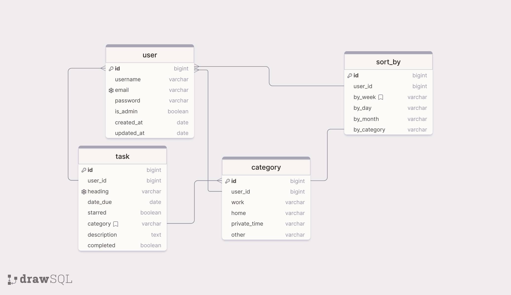

# Mom Schedule
## A Time Planning Tool for Busy Mothers

- address the user persona from my previous projects. https://github.com/annagabain/Mom-Lifehacks#User-Experience-and-User-Interface-Design-UX-and-UI
- includes a calendar, event editing, creating task cards.

## Portfolio Project 4

Full-Stack Toolkit
Project purpose:

In this project, you'll build a Full-Stack site based on business logic used to control a centrally-owned dataset. You will set up an authentication mechanism and provide role-based access to the site's data or other activities based on the dataset.

## Main Technologies
HTML, CSS, JavaScript, Python+Django
Postgres Relational database 

## User Stories

- Account authorisation - Login

- As a site user I can see the Schedule so that I can overview my tasks

- View a Task

- Edit a Task

## Desktop Wireframes

*Today View*

 

*Login / Register View*

 

*Edit Task View*

 

*This Week View*

*DRAFT PgSQL Relational Database Diagram*

## Tools

Wireframes: https://www.figma.com/

## Sources

Django models: https://docs.djangoproject.com/en/4.1/topics/db/models/

How to create a calendar with Django:  https://www.huiwenteo.com/normal/2018/07/24/django-calendar.html

Develop a Simple Python Django ToDo App in 1 minute: https://dev.to/nditah/develop-a-simple-python-django-todo-app-in-1-minute-4908

