# Mom Schedule
## A Time Planning Tool for Busy Mothers

Mom Schedule is a time-planning tool for busy Mothers. Mom Schedule has a calendar and offers event editing and creating task cards.

As a site user, you can: Log in, Create Tasks, Categorize and Filter by following criteria: All Tasks, Calendar - to Overview your Month, See Completed Tasks Only, Hide Completed Tasks, Filter by Due Date, Filter by selected Category - Work, Childcare, Household, Health, Free time and Other tasks.

Main Technologies:
HTML, CSS, JavaScript, Python+Django
Postgres Relational database 

This is the fourth Portfolio Project in frames of the Code Institute Full Stack Web Developer Course Assessment. Portfolio Project 4: Full-Stack Toolkit. Project purpose, as per curriculum requirement: "In this project, you'll build a Full-Stack site based on business logic used to control a centrally-owned dataset. You will set up an authentication mechanism and provide role-based access to the site's data or other activities based on the dataset."

:point_down: Click the link below for the live view: 

# [Live View](https://mom-schedule.herokuapp.com/)

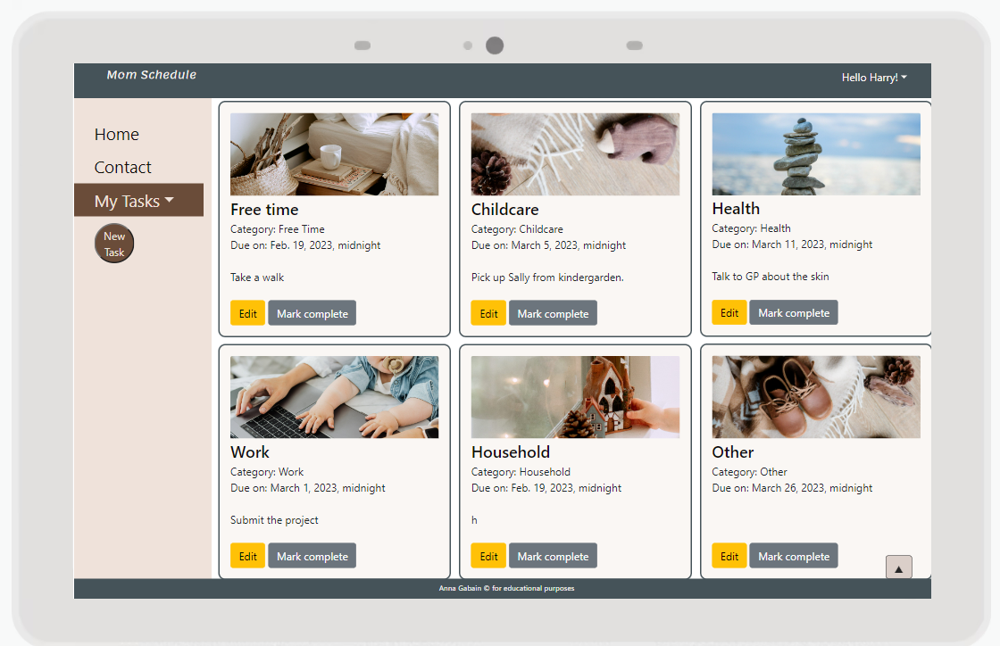 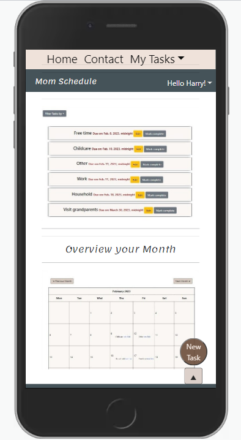

## Contents:
- [UX](#ux)
    - [User Stories](#user-stories)
    - [Responsivity](#responsivity)
- [Features](#features)
    - [Homepage](#homepage)
        - [Welcoming Intro](#welcoming-intro)
        - [Site Header and Log in](#site-header-and-log-in)
    - [Authentication and Authorization](#register-and-log-in)
    - [Site Navigation](#site-navigation)
        - [Sidebar](#sidebar)
    - [My Tasks](#my-tasks)
        - [Filter by](#filter-by)
    - [Contact Us](#contact-us)
    - [New Task](#new-task)
    - [Future Features](#future-features)
- [Development Stages](#development-stages)
    - [Planning](#planning)
    - [Structure](#structure)
    - [Using Frameworks and Libraries](#using-frameworks)
- [Testing](#testing)
    - [Validators](#validators)
    - [Manual Testing](#manual-testing)
    - [Automatic Testing - Writing Functions](#automatic-testing---writing-functions)
    - [Debugging](#debugging)
- [Deployment](#deployment)
    - [Heroku](#creating-the-heroku-app)
- [Sources & Credits](#sources)
    - [Sources](#sources)
    - [Tools](#tools)
    - [Acknowledgments](#acknowledgments)

## UX

It is crucial to identify and get to know the website user in order to enhance the user experience. A Persona method helps 'bringing to life' a real-life individual with personality traits, favourite choices and preferences. Jane Smith (the Persona) is a working mother that loves bio products and enjoys walks in the nature. She will like the Mom Schedule colour pallette in natural tones. The persona summary is created with a tool called Xtensio that helps to conduct a virtual UX analysis. Additionally, a customer journey tracking was conducted to follow Jane's navigation and make it to her most convenience.

More about this user Persona is described in my previous project, called Mom Lifehacks: https://github.com/annagabain/Mom-Lifehacks#User-Experience-and-User-Interface-Design-UX-and-UI

### User Stories

- As a site user, I can register so that I can have a unique and private schedule.

- As a site user, I can **log in** so that I can view my own schedule.

- As a user, I can see a navigation option (sidebar) so that I can create, sort my tasks, manage them, as well as find the contact option.

- CRUD * - As a site user I can **Create** a task so that I can note down an event or an activity.

- CRUD - As a site user, I can **View** an individual task so that I can read the details of it.

- CRUD - As a site user, I can **Edit** an individual task so that I can adapt it to my needs.

- CRUD - As a site user I can **Delete** an individual task so that I can remove the no longer needed information.

- As a user I can see my tasks as cards so that I have a better visual overview.

- As a user, I can view my tasks marked on a calendar so that I can remember the dates.

- As user I can contact the site owners so that can ask questions or provide feedback.

- As **a Site Admin**, I can log in so that I can **view and manage the users, task categories and tasks**.

- As a Site Admin, I can see the messages sent from the 'contact us' form so that I can **communicate with the user**.

- As a Site Admin, I can access the user registration information so that I can help them changing the passwords, editing or deleting the accounts.

All user stories as part of a project: https://github.com/users/annagabain/projects/7/views/1

CRUD *  means CREATE, READ, UPDATE and DELETE

### Responsivity

*Initial test result: Am I responsive?*

*The Methods*

Bootstrap5 features and custom CSS

## Features

### Homepage

#### Welcoming Intro

The welcoming intorduction is visible to everyone, regardless of their log in status. This overview provides information about the application features and functionality. Sample screenshots show what to expect seeing once registered and logged in.

#### Site Header and Log in

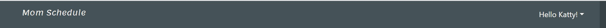
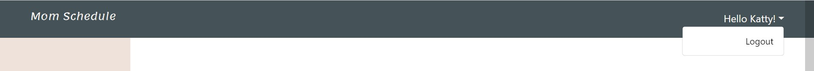

### Authentication and Authorization

*Register and Log in*

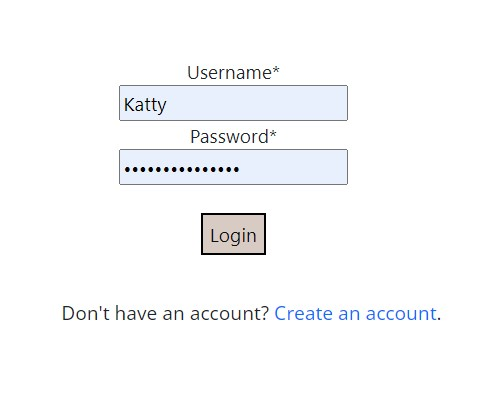 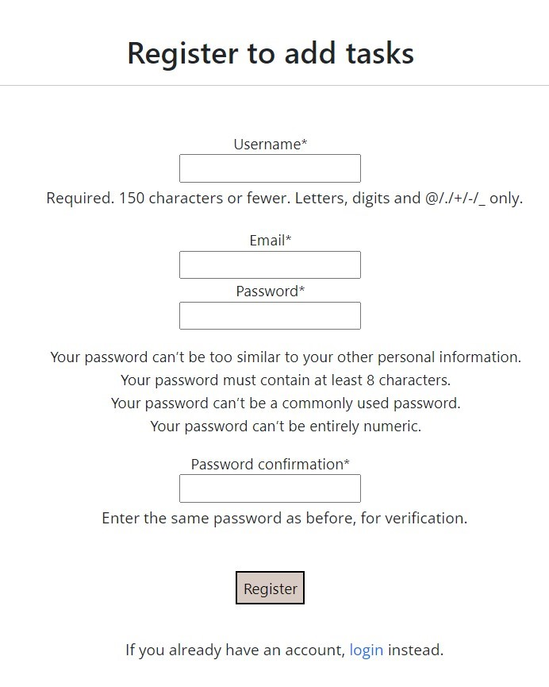

### Site Navigation
#### Sidebar

Homepage, Contact form, My Tasks and Filtering dropdown, including the Calendar view, New Task button.

### My Tasks

Upon clicking the My Tasks dropdown, the user navigates through the Task filtering, the first of which is viewing all of the tasks.

#### Filter by

*Sidebar dropdown with nested categories dropdown*

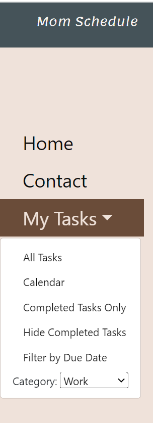 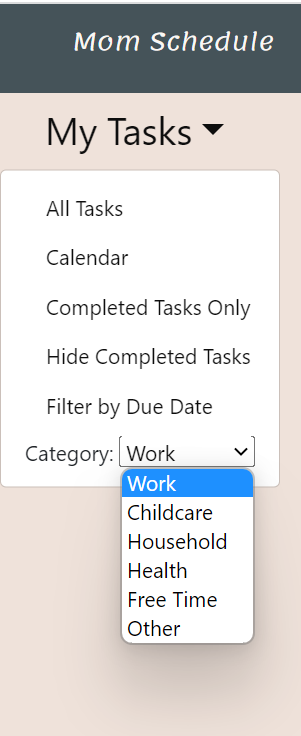

*Filtering Tasks*

Show all:

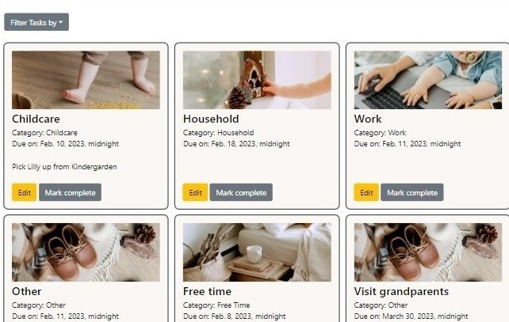

Show Headlines on Calendar:

By due date (for urgency):

### Contact Us

### New Task

### Future Features

- Week view
- Day view
- Mark start and end dates and show them as a span between the calendar dates
- Highlight today in the Calendar
- Show urgent deadlines (send notifications)

## Development Stages

### Planning

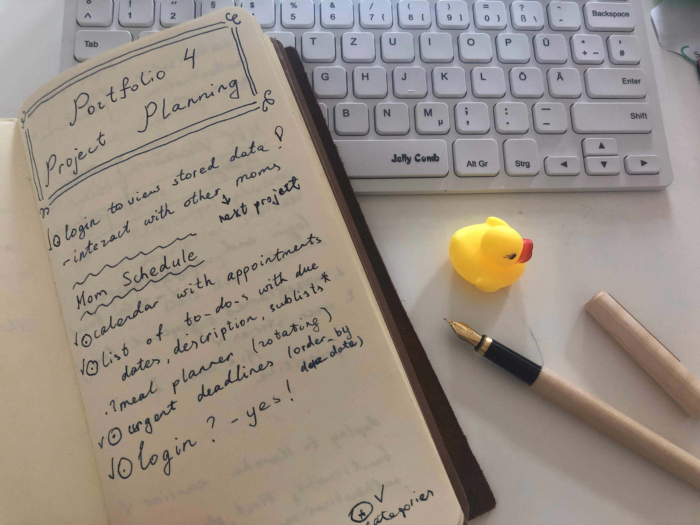

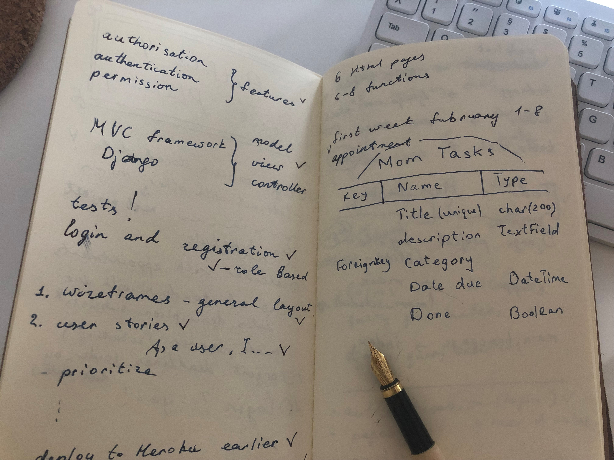

#### Desktop Wireframes

*Today View, now All Tasks*

*Login / Register View, now in separate windows*

  

*Edit Task View*

*Initially 'This Week View', now Month's Calendar*

 

### Structure

*PgSQL Relational Database Diagram*

### Using Frameworks

Django 

Bootstrap 5

### Using Source code

Some parts of the projects have been created using sections of code from other sources. An example of this is the HTML calendar feature, that was partially taken from a repository: https://github.com/sajib1066/event-calendar , forked and adapted to the Mom Schedule project.

## Testing

### Validators

### Manual Testing

### Automatic Testing - Writing Functions

#### Test functions
Django’s unit tests use a Python standard library module: unittest. This module defines tests using a class-based approach.

tests.py

in terminal: **python3 manage.py test**

*test_forms.py*

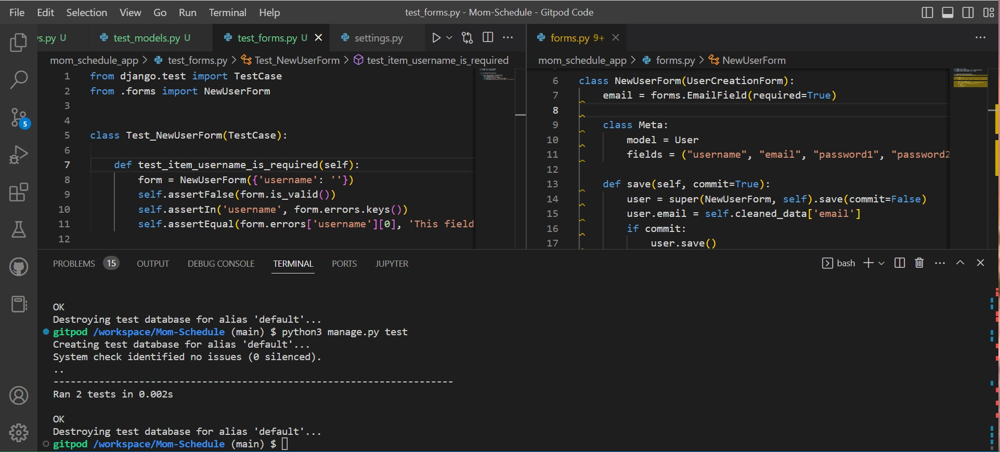 

python3 manage.py test mom_schedule_app.test_forms

python3 manage.py test mom_schedule_app.test_forms.Test_NewUserForm

python3 manage.py test mom_schedule_app.test_forms.Test_NewUserForm.test_item_email_is_required

#### Coverage

in Terminal:

pip3 install coverage

coverage run --source=mom_schedule_app manage.py test

**coverage report nr. 1**

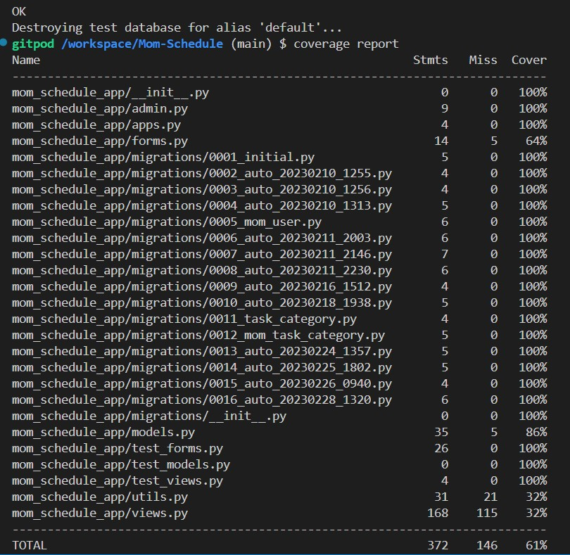 

**coverage html**

coverage html
python3 -m http.server

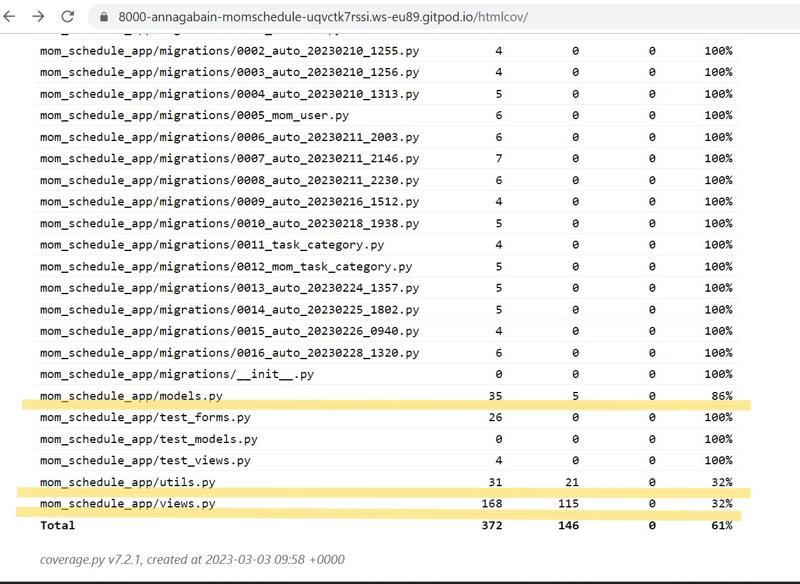 

The coverage report nr.1 showed there are improvements to make in the following tests :

- test_models.py - tested 86%, so 14% was yet to be improved
- test_utils.py - tested 32%, so 68% was yet to be improved
- test_views.py - tested 32%, so 68% was yet to be improved

**test_models.py**

**test_utils.py**

**test_views.py**

**coverage report nr. 2**

### Debugging

:lady_beetle: - *Static files weren't included by Heroku after deployment.*

:bulb: - Using the WhiteNoise package fixed the issue.

*Before*

 

*After*

-----------------------------------------------------------------------------------

:lady_beetle: - *Title prepopulated with the first word only*

:mag: {{ title }}

:bulb: Changed to {{ 'title' }} as a string and it worked

-----------------------------------------------------------------------------------

:lady_beetle: - *Date Format*

having trouble with the date formats in Django. The HTML form has dd-mm-yyyy and Django has yyyy-mm-dd.
They somehow communicate to save the date correctly in the database but the problem occurs when I try editing one of my Tasks, by clicking the yellow edit button for a specific task on my all_tasks.html. 

It **did not prepopulate the date dropdown** and threw an error when trying to submit without choosing the date over again. However, editing inside the admin site worked well (it displayed yyyy-mm-dd).

 

 

:mag: - Tried solving by adding this code to settings.py: 

LANGUAGE_CODE = 'en-us'

USE_L10N = False

DATE_INPUT_FORMATS = ['%d-%m-%Y']

It did not work

:bulb: - I found a solution:

Changed the date format in my edit function in views.py as follows:

...

date.strftime("%Y-%m-%d"),

Now it prepopulates my field with the date as dd-mm-yyyy. The mom_task is then saved without errors.

-----------------------------------------------------------------------------------

:lady_beetle: TestCase Bug
- *Got an error creating the test database: permission denied to create database*

*Before*

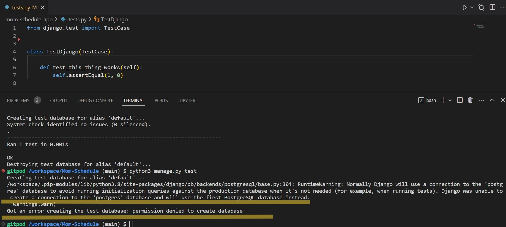 

:mag:  - Checking the current database settings in settings.py

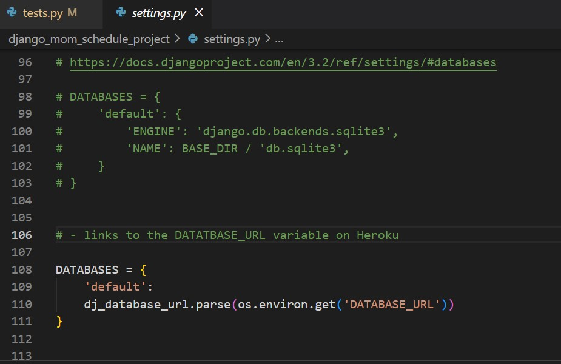 

:bulb: - Temporarily activating the sqlite3 Django backends database fixed the issue.

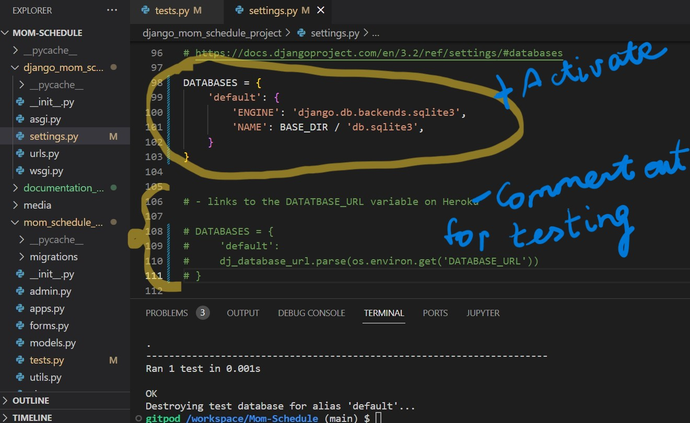 

*After*

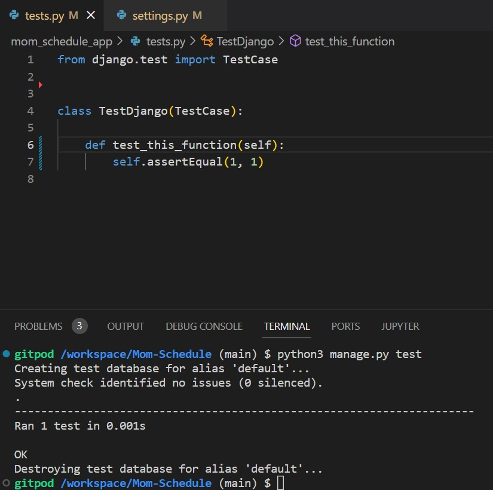 

## Deployment

The project is deployed to GitHub via Gitpod Terminal with an integrated VScode editor. Then it is connected to the Heroku app to be reached via a web browser for user convenience. To enable this, a special Code Institute template was cloned and used https://github.com/Code-Institute-Org/python-essentials-template .

The app is run in the backend terminal using **python3 manage.py runserver** and dependencies are placed in the requirements.txt file. The instruction on Heroku deployment was taken from the Code Institute Love Sandwiches walkthrough project, step by step as required.

### Creating the Heroku app

The project was deployed to Heroku as follows:

- Create an account and log in to https://www.heroku.com/
- Click 'New' from the dashboard, and from the drop-down menu select "Create new app"
- Make a unique app name: mom-data
- Choose a relevant geographical region, Europe
- Click "Create app"
- In the settings menu, go to "Config Vars" section
- Click "Reveal Config Vars", where dependencies are installed
- In "Deploy" tab, select Github as the deployment method
- Connect to GitHub
- Find the project repository and click "connect" next to it
- "Enable Automatic Deploys" for automatic deployment with every new change

## Tools

Wireframes: https://www.figma.com/
Bootstrap grid: https://getbootstrap.com/docs/4.1/layout/grid/

## Sources & Credits
### Sources
Writing and running tests in Django: https://docs.djangoproject.com/en/4.1/topics/testing/overview/

CSS tricks: https://css-tricks.com/snippets/css/a-guide-to-flexbox/#top-of-site

How to Create a Dropdown List in Django python: https://labpys.com/how-to-create-cascading-dependent-dropdown-list-in-django-python/?utm_content=cmp-true

Grid system: https://getbootstrap.com/docs/5.0/layout/grid/

Python Datetime: https://www.w3schools.com/python/python_datetime.asp

User Specific Pages: https://www.techwithtim.net/tutorials/django/user-specific-pages-data/

Setup Bootstrap messages for Django: https://ordinarycoders.com/blog/article/django-messages-framework

Django project base template: https://stackoverflow.com/questions/14720464/django-project-base-template#:~:text=Yes%2C%20you%20can%20use%20%7B%25,where%20to%20place%20the%20base.

A guide to user registration: https://ordinarycoders.com/blog/article/django-user-register-login-logout

Using WhiteNoise with Django: https://whitenoise.evans.io/en/stable/django.html

Django and Static Assets: https://devcenter.heroku.com/articles/django-assets?fbclid=IwAR16j_4bi-WEMxrA-VwWmFUfPOFP9ef2Kqzb6lM1pVCiKti_dhwoku1ceEg

Django models: https://docs.djangoproject.com/en/4.1/topics/db/models/

How to create a calendar with Django:  https://www.huiwenteo.com/normal/2018/07/24/django-calendar.html

Event Calendar sample project and some source code: https://github.com/sajib1066/event-calendar

Develop a Simple Python Django ToDo App in 1 minute: https://dev.to/nditah/develop-a-simple-python-django-todo-app-in-1-minute-4908

### Acknowledgments

Richard Wells - the course mentor for friendly guidance, help with refactoring some code and numerous project feedback sessions

Jakob Lövhall - help with Python datetime formatting

:point_up_2: [Back to Contents](#contents)