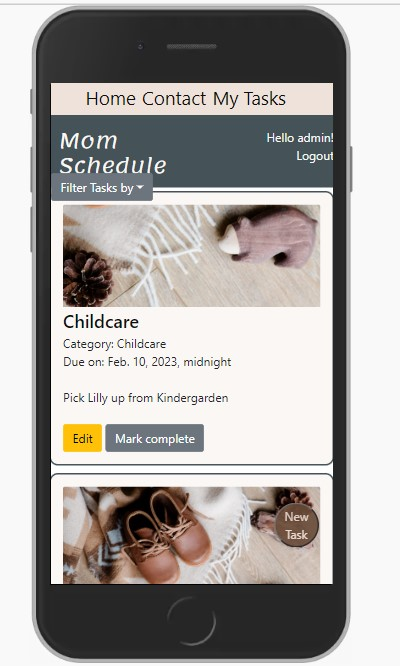
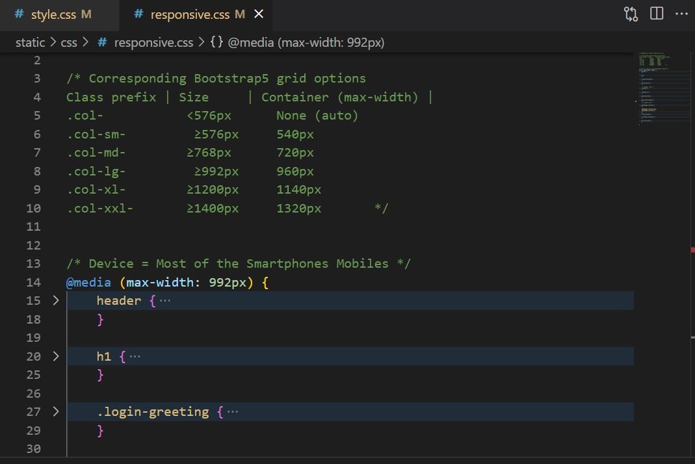
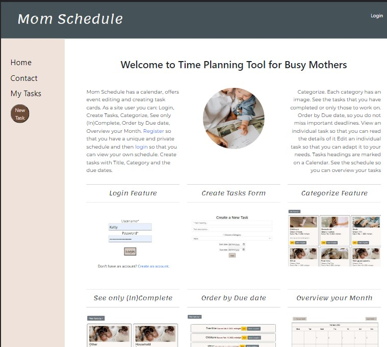
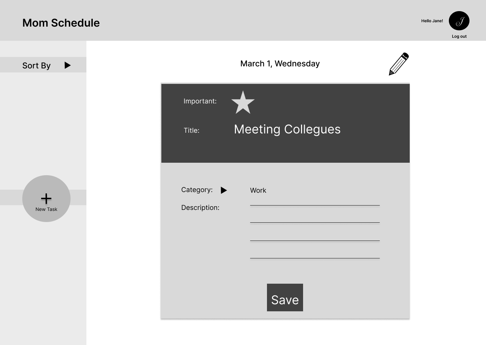
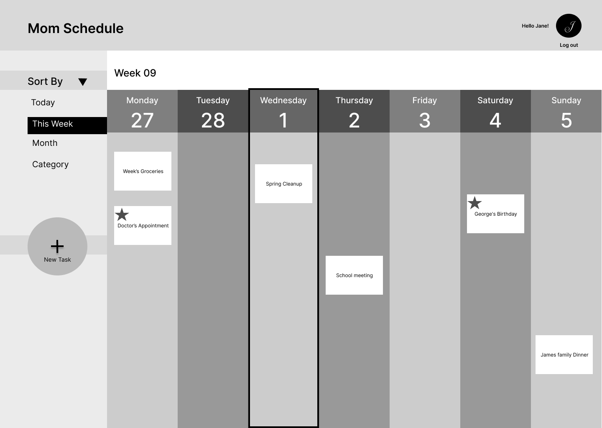
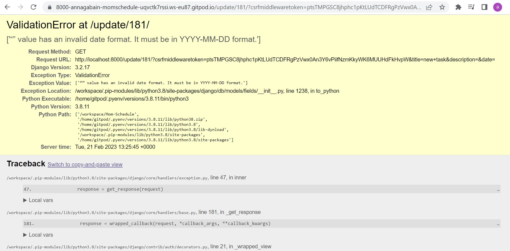

# Mom Schedule
## A Time Planning Tool for Busy Mothers

## Main Technologies
HTML, CSS, JavaScript, Python+Django
Postgres Relational database 

:point_down: Click the link below for the live view: 

Live View https://mom-schedule.herokuapp.com/

  

## Portfolio Project 4

Full-Stack Toolkit
Project purpose:

In this project, you'll build a Full-Stack site based on business logic used to control a centrally-owned dataset. You will set up an authentication mechanism and provide role-based access to the site's data or other activities based on the dataset.

- address the user persona from my previous projects. https://github.com/annagabain/Mom-Lifehacks#User-Experience-and-User-Interface-Design-UX-and-UI
- includes a calendar, event editing, creating task cards.

## Contents:
- [UX](#ux)
    - [User Stories](#user-stories)
    - [Responsivity](#responsivity)
- [Features](#)
    - [Welcoming Intro](#)
    - [Main Menu](#)
    - [HOME](#)
    - [My Tasks](#)
    - [(Sort by)](#)
    - [Contact Us](#)
    - [New Task](#)
    - [Future Features](#)
- [Development Stages](#)
    - [Planning](#)
    - [Structure](#)
    - [Using Libraries](#)
- [Testing](#testing)
    - [Validators](#)
    - [Manual Testing](#)
    - [Debugging](#debugging)
- [Deployment](#)
    - [Heroku](#)
- [Sources & Credits](#sources)
    - [Sources](#sources)
    - [Tools](#tools)
    - [Acknowledgments](#acknowledgments)

## UX
### User Stories

- As a site user I can register so that I can have a unique and private schedule

- As a site user I can login so that I can view my own schedule

- As a site user I can see the schedule so that I can overview my tasks

- As a site user I can View an individual task so that I can read the details of it

- As a site user I can Edit an individual task so that I can adapt it to my needs

- As **a site Admin** I can **login** so that I can **view and manage the users and tasks**

All user stories as part of a project: https://github.com/users/annagabain/projects/7/views/1

### Responsivity

*Test result: Am I responsive?*

*The Methods*

Bootstrap5 features and custom css

## Features
### Welcoming Intro

    - [Main Menu](#)
    - [HOME](#)
    - [My Tasks](#)
    - [Filter by](#)
    - [Contact Us](#)
    - [New Task](#)
    - [Future Features](#)

- [Development Stages](#)
    - [Planning](#)
    - [Structure](#)
    - [Using Frameworks](#)
    - [Using Source code](#)

## Desktop Wireframes

*Today View*

 

*Login / Register View*

 

*Edit Task View*

 

*This Week View*

*PgSQL Relational Database Diagram*

## Testing

### Validators

### Manual Testing

### Django testing 
Test functions
tests.py
test_forms.py
test_views.py
test_models.py
Coverage

### Debugging

:lady_beetle: - *Static files weren't included by Heroku after deployment.*

:bulb: - Using WhiteNoise package fixed the issue.

*Before*

 

*After*

:lady_beetle: - *Title prepopulated with the first word only*

:mag: {{ title }}

:bulb: Changed to {{ 'title' }} as a string and it worked

:lady_beetle: - *Date Format*

having trouble with the date formats in Django. The html form has dd-mm-yyyy and Django has yyyy-mm-dd.
They somehow communicate innerly to save the date correctly in the database but the problem occurs when I try editing one of my Task, by clicking the yellow edit button for a specific task on my all_tasks.html. 

It **did not prepopulate the date dropdown** and threw an error when trying to submit without chosing the date over again. However, editing inside the admin site worked well (it displayed yyyy-mm-dd).

 

 

:mag: - Tried solving by adding this code to settings.py: 

LANGUAGE_CODE = 'en-us'

USE_L10N = False

DATE_INPUT_FORMATS = ['%d-%m-%Y']

It did not work

:bulb: - I found a solution:

Changed the date format in my edit function in views.py as following:

...

date.strftime("%Y-%m-%d"),

Now it prepopulates my field with date as dd-mm-yyyy. The mom_task is then saved without errors.

- [Deployment](#d)
    - [Heroku](#)

## Tools

Wireframes: https://www.figma.com/
Bootstrap grid: https://getbootstrap.com/docs/4.1/layout/grid/

## Sources & Credits
### Sources

CSS tricks: https://css-tricks.com/snippets/css/a-guide-to-flexbox/#top-of-site

How to Create a Dropdown List in Django python: https://labpys.com/how-to-create-cascading-dependent-dropdown-list-in-django-python/?utm_content=cmp-true

Grid system: https://getbootstrap.com/docs/5.0/layout/grid/

Python Datetime: https://www.w3schools.com/python/python_datetime.asp

User Specific Pages: https://www.techwithtim.net/tutorials/django/user-specific-pages-data/

Setup Bootstrap messages for Django: https://ordinarycoders.com/blog/article/django-messages-framework

Django project base template: https://stackoverflow.com/questions/14720464/django-project-base-template#:~:text=Yes%2C%20you%20can%20use%20%7B%25,where%20to%20place%20the%20base.

A guide to user registration: https://ordinarycoders.com/blog/article/django-user-register-login-logout

Using WhiteNoise with Django: https://whitenoise.evans.io/en/stable/django.html

Django and Static Assets: https://devcenter.heroku.com/articles/django-assets?fbclid=IwAR16j_4bi-WEMxrA-VwWmFUfPOFP9ef2Kqzb6lM1pVCiKti_dhwoku1ceEg

Django models: https://docs.djangoproject.com/en/4.1/topics/db/models/

How to create a calendar with Django:  https://www.huiwenteo.com/normal/2018/07/24/django-calendar.html

Event Calendar sample project and some source code: https://github.com/sajib1066/event-calendar

Develop a Simple Python Django ToDo App in 1 minute: https://dev.to/nditah/develop-a-simple-python-django-todo-app-in-1-minute-4908

### Acknowledgments

Richard Wells - the course mentor for friendly guidance, help with refactoring some code and numerous project feedback sessions

Jakob Lövhall - help with Python datetime formatting

:point_up_2: [Back to Contents](#contents)